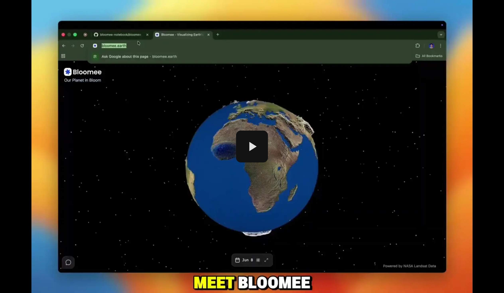
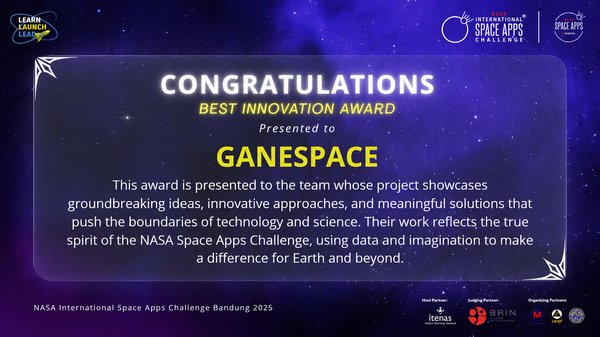
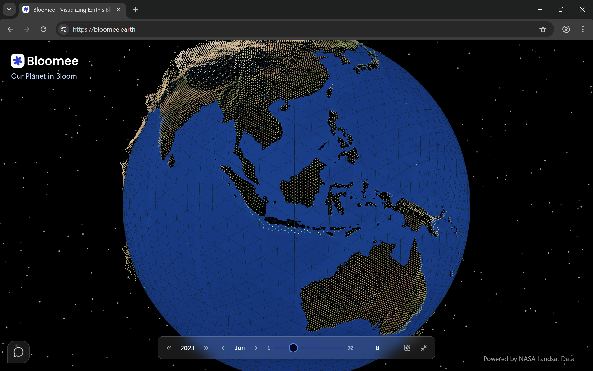
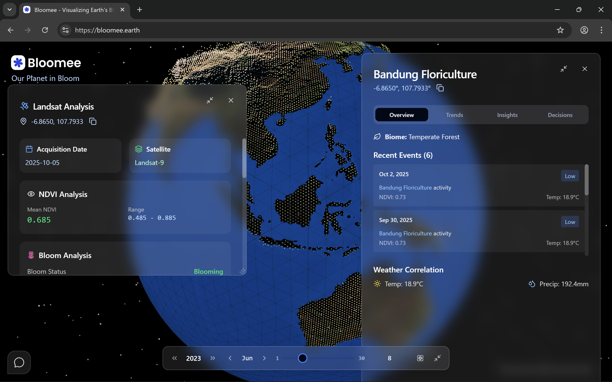
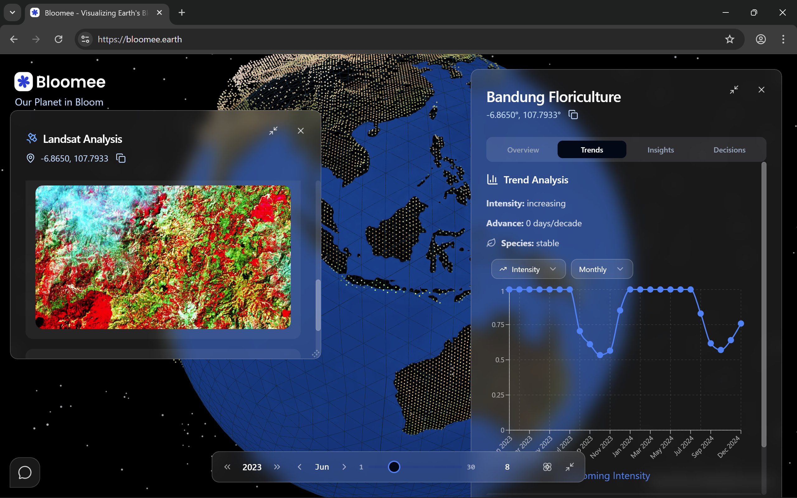
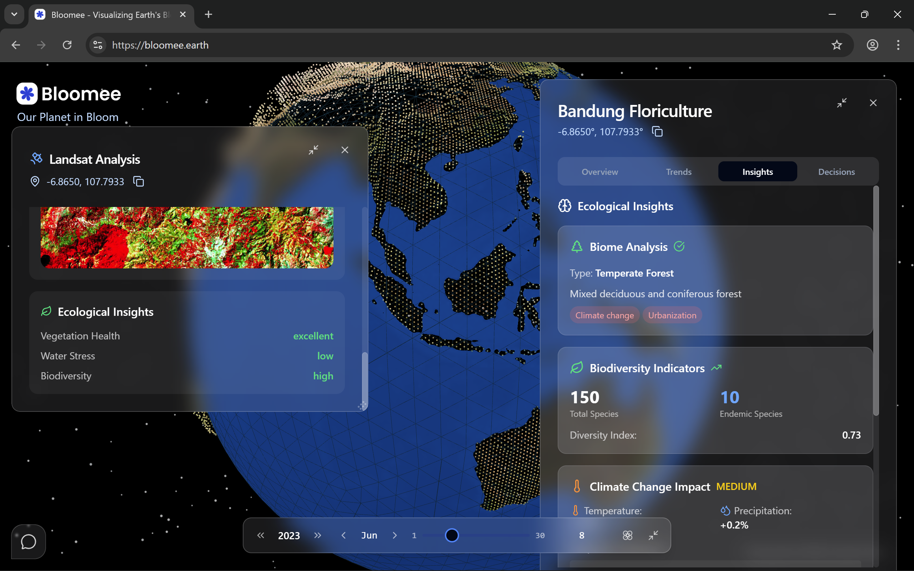
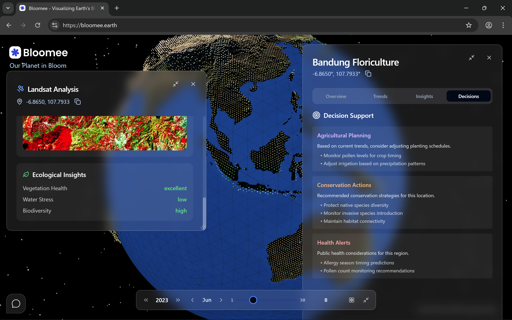
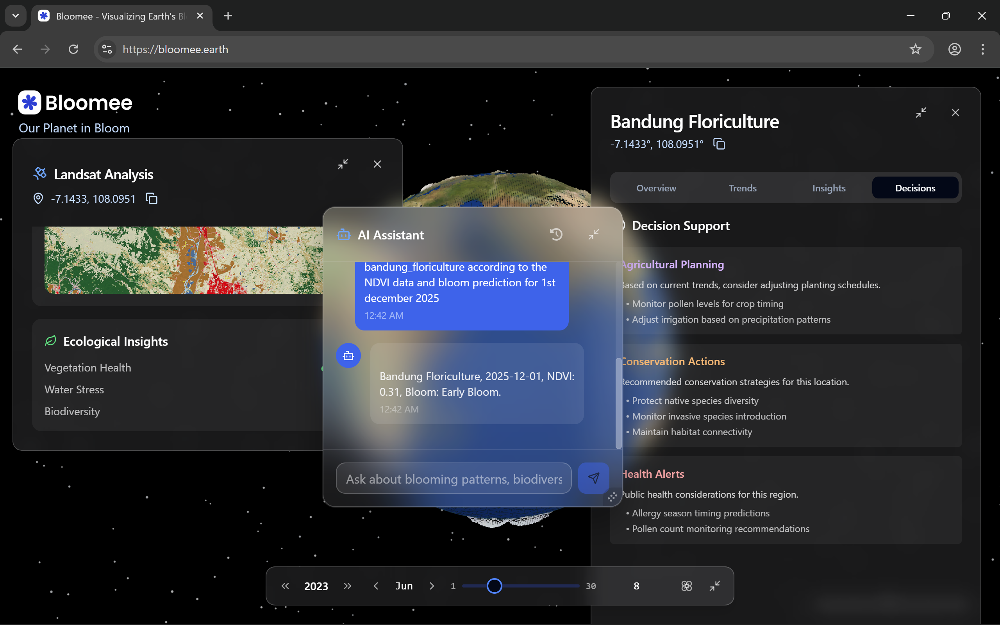

  
  
  # 🌸 Bloomee
  
  **Interactive Earth-observation platform for global flowering phenology**
  
  *Witness the pulse of life across our planet through space and time*

  
  
  
  

  **🏆 NASA Space Apps Challenge 2025 Solution**
  
  Built by [Team Ganespace](https://www.spaceappschallenge.org/2025/find-a-team/ganespace/) for [Bandung, Indonesia](https://www.spaceappschallenge.org/2025/local-events/bandung/)

---

## 🌍 About Bloomee

Bloomee is an interactive Earth-observation platform that **detects, visualizes, and explains flowering events across space and time**—putting the "where, when, and why" of blooms in one place. From tracking cherry blossoms in Japan to monitoring wildflower superblooms in California, Bloomee harnesses the power of NASA's Earth observation data to understand global flowering phenology.

<table>
<tr>
<td width="50%">

<em>🎥 Watch the project showcase video</em>

</td>
<td width="50%">

<em>📊 View the presentation deck</em>

</td>
</tr>
</table>

### 🏆 Competition Achievement

Bloomee was built for the [NASA Space Apps Challenge 2025](https://www.spaceappschallenge.org/2025/) — the world's largest annual global hackathon, where thousands of teams across hundreds of cities use NASA's open Earth and space data to build solutions for real-world challenges over a single weekend.

Competing in the **["BloomWatch: An Earth Observation Application for Global Flowering Phenology"](https://www.spaceappschallenge.org/2025/challenges/bloomwatch-an-earth-observation-application-for-global-flowering-phenology/)** challenge, Team [Ganespace](https://www.spaceappschallenge.org/2025/find-a-team/ganespace/) built Bloomee to harness NASA Earth observation data for a dynamic visual tool that displays and detects plant blooming events around the globe.

At the [Bandung, Indonesia](https://www.spaceappschallenge.org/2025/local-events/bandung/) local event, Bloomee earned:

- 🥇 **Winner** — NASA Space Apps Challenge 2025, Bandung Chapter
- 🌟 **Best Innovation Award** — NASA Space Apps Challenge 2025, Bandung Chapter
- 🌍 **Global Finalist Nominee** — advanced to global nomination as a result of the Bandung Chapter win

<em>Team Ganespace receiving the Best Innovation Award for Bloomee at NASA Space Apps Challenge 2025, Bandung, Indonesia</em>

### ✨ Key Features

- **🌐 Interactive 3D Globe**: Explore blooming events across the planet with intuitive navigation
- **⏰ Time-Series Analysis**: Scrub through seasons with temporal sliders to observe phenological changes
- **📊 Regional Detail Panel**: Deep-dive into NDVI trends, species events, intensity, and weather correlations
- **🤖 Agentic AI-Powered Assistant**: Natural-language queries with contextual recommendations
- **🔮 Predictive Modeling**: Advanced ML forecasting with confidence intervals
- **📈 Multi-Model Ensemble**: Automatic selection of best-performing algorithms per region

### 🛰️ Data Sources

Bloomee integrates multiple NASA Earth observation datasets:

- **MODIS NDVI** (16-day, 1 km resolution) - Vegetation index monitoring
- **Landsat-9** - High-resolution NDVI detection and quality validation
- **Land Surface Temperature** - Environmental correlation analysis
- **GPM IMERG Precipitation** - Weather pattern integration

### 🧠 AI & Machine Learning

Under the hood, Bloomee evaluates multiple forecasting models per region:
- **ARIMA & SARIMA** - Time series analysis
- **Prophet** - Trend decomposition and seasonality
- **LSTM Neural Networks** - Deep learning patterns
- **Gradient Boosting** - Ensemble learning
- **Random Forest** - Feature importance analysis

The platform auto-selects the best-performing model and outputs bloom/NDVI forecasts with confidence intervals.

## 📸 Platform Screenshots

<table>
<tr>
<td width="50%">

#### 🌍 Interactive 3D Globe

<em>Default view when users land on the website - explore flowering events across the interactive 3D globe</em>

</td>
<td width="50%">

#### 🛰️ Landsat Analysis & Species Overview

<em>Detailed Landsat analysis with NDVI data and comprehensive flower species overview</em>

</td>
</tr>
<tr>
<td width="50%">

#### 📊 Satellite Imagery & NDVI Trends

<em>Satellite imagery visualization with NDVI trend analysis and temporal data charts</em>

</td>
<td width="50%">

#### 🌿 Ecological Insights & Biodiversity

<em>Comprehensive ecological insights including biodiversity indicators and climate change impact assessment</em>

</td>
</tr>
<tr>
<td width="50%">

#### 🎯 Decision Support Systems

<em>Actionable decision support for agricultural planning, conservation actions, and health alert systems</em>

</td>
<td width="50%">

#### 🤖 Agentic AI Assistant

<em>Intelligent AI chatbot that queries forecasts, searches online insights, and accesses research papers</em>

</td>
</tr>
</table>

---

## 🏗️ Architecture & Repositories

Bloomee is built as a modular ecosystem of specialized repositories:

### 📱 [bloomee-web](https://github.com/bloomee-app/bloomee-web)
**Interactive Web Application** - Next.js frontend with 3D visualization

**Tech Stack:**
- **Framework**: Next.js 14, TypeScript
- **3D Rendering**: Three.js, React Three Fiber, React Three Drei
- **UI Components**: Radix UI, Tailwind CSS, Framer Motion
- **Mapping**: MapLibre GL, React Map GL
- **Charts**: Recharts
- **State Management**: Zustand
- **Animation**: Anime.js

### 🤖 [bloomee-ai](https://github.com/bloomee-app/bloomee-ai)
**AI Forecasting Engine** - FastAPI backend with ML models

**Tech Stack:**
- **Framework**: FastAPI, Python
- **Machine Learning**: Scikit-learn, NumPy, Pandas
- **Time Series**: ARIMA, SARIMA, Prophet, LSTM
- **Ensemble Methods**: Gradient Boosting, Random Forest
- **API Server**: Uvicorn
- **Data Processing**: SciPy, Joblib

### 📓 [bloomee-notebook](https://github.com/bloomee-app/bloomee-notebook)
**Research & Development** - Jupyter notebooks with model development

**Purpose:**
- Model training and validation
- Feature engineering experiments
- Algorithm performance comparison
- Data analysis and visualization

### 💬 [bloomee-chatbot](https://github.com/bloomee-app/bloomee-chatbot)
**Conversational AI Assistant** - Dify.ai powered intelligent agent

**Tech Stack:**
- **Platform**: Dify.ai workflow automation
- **LLM**: Google Gemini 2.5 Flash Lite
- **Search Integration**: Perplexity AI
- **Knowledge Base**: Vector embeddings with OpenAI text-embedding-3-small
- **API Integration**: Custom NDVI prediction endpoints

**Capabilities:**
- Natural language NDVI queries
- Regional bloom forecasting
- Weather correlation analysis
- Species identification assistance

---

## 🌐 Deployment

### Live Applications
- **🌍 Web Platform**: [bloomee.earth](https://bloomee.earth/)
- **🤖 AI API**: [ai.bloomee.earth](https://ai.bloomee.earth/)

### 📋 Resources
- **📊 Presentation Deck**: [cdn.bloomee.earth/deck.pdf](https://cdn.bloomee.earth/deck.pdf)
- **🎥 Demo Video**: [YouTube Presentation](https://www.youtube.com/watch?v=5xR50jDX2gA)

---

## 🚀 Getting Started

### Quick Demo
Visit [bloomee.earth](https://bloomee.earth/) to explore:
1. **Navigate the 3D globe** to find regions of interest
2. **Use the time slider** to observe seasonal changes
3. **Click on bloom markers** to open detailed analysis
4. **Ask the AI assistant** natural language questions about flowering patterns

### API Access
The AI forecasting engine is available at [ai.bloomee.earth](https://ai.bloomee.earth/) with endpoints for:
- **Regional NDVI prediction**
- **Multi-day bloom forecasting**
- **Model performance metrics**

### Local Development
Each repository contains detailed setup instructions:
- [`bloomee-web/README.md`](https://github.com/bloomee-app/bloomee-web) - Frontend development
- [`bloomee-ai/README.md`](https://github.com/bloomee-app/bloomee-ai) - ML model deployment
- [`bloomee-chatbot/README.md`](https://github.com/bloomee-app/bloomee-chatbot) - AI assistant configuration

---

## 🎯 Impact & Applications

### 🌾 Agricultural Monitoring
- **Crop flowering prediction** for harvest optimization
- **Pollinator activity correlation** with bloom timing
- **Disease management** through phenological pattern analysis

### 🌿 Conservation Efforts
- **Invasive species detection** through anomalous bloom patterns
- **Climate change impact assessment** via long-term phenological shifts
- **Biodiversity monitoring** across protected ecosystems

### 🏙️ Urban Planning
- **Allergen forecasting** for public health initiatives
- **Tourism optimization** for bloom-dependent destinations
- **Green infrastructure** planning and assessment

### 🔬 Scientific Research
- **Phenological research** with automated data collection
- **Climate correlation studies** across multiple datasets
- **Species distribution modeling** enhancement

---

## 🤝 Contributing

We welcome contributions to advance global flowering phenology research! Each repository has specific contribution guidelines:

- **🐛 Bug Reports**: Submit issues with detailed reproduction steps
- **💡 Feature Requests**: Propose enhancements with use-case descriptions  
- **📊 Data Contributions**: Help expand regional datasets and validation
- **🔬 Research Collaboration**: Partner on phenological studies and publications

---

## 📄 License

This project is part of the NASA Space Apps Challenge 2025. Please refer to individual repository licenses for specific terms.

---

## 🌟 Acknowledgments

- **NASA Earth Science Division** for comprehensive Earth observation data
- **NASA Space Apps Challenge** for fostering innovation in space technology
- **Google Earth Engine** for powerful geospatial analysis capabilities
- **Dify.ai** for conversational AI infrastructure
- **Open Source Community** for foundational frameworks and libraries

---

  
  **🌸 Bloomee - Unveiling Earth's Flowering Rhythms Through Space and Time 🌸**
  
  *Built with ❤️ by Team Ganespace for NASA Space Apps Challenge 2025*

